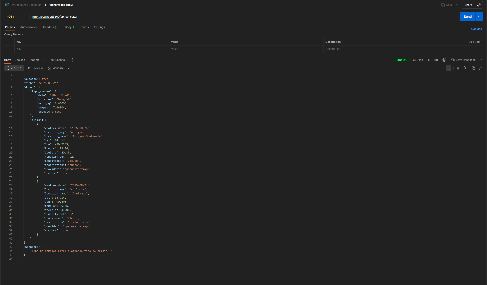
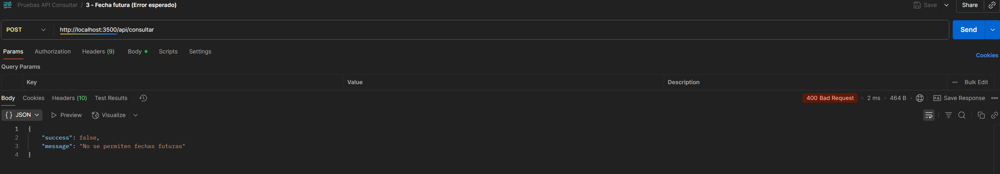
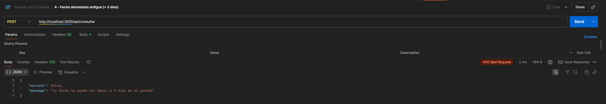
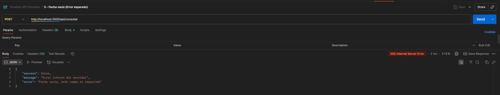
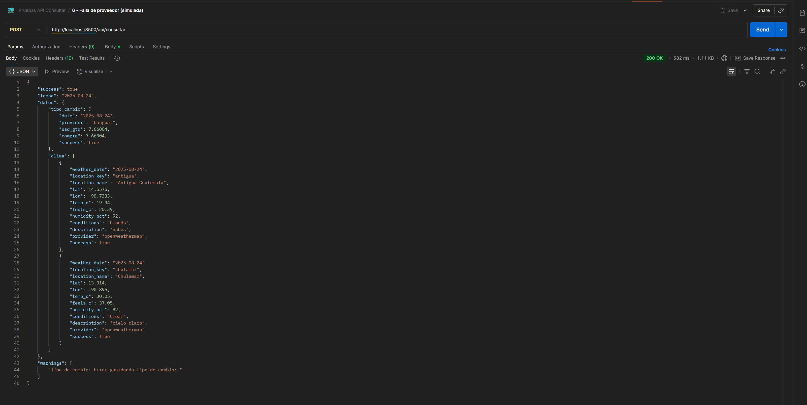
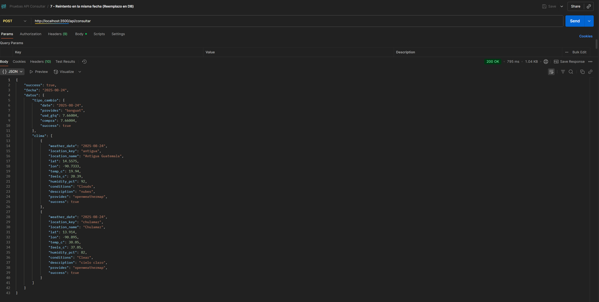
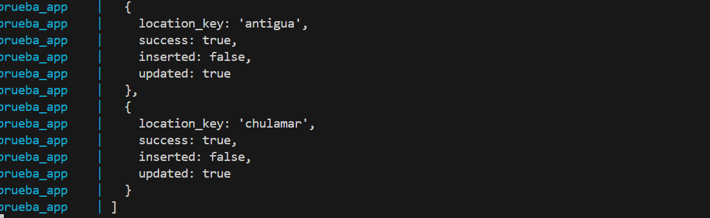

# Analisis de la prueba tecnica

# Decisiones

- Al ver las opciones que brinda el Banguat para recuperar los datos, la mejor opcion es el del rango, ya que me permite seleccionar fecha de inicio y fecha de fin. La prueba pide que solo sea de un dia, no un rango, por lo que lo mas facil para taclear este problema es que la fecha de inicio y la de fin sean la misma, asi se pueden recuperar de un solo dia. 

- Al hacer el servicio para la API de banguat decidi que el mejor fallback sea que recupere los datos del dia de hoy.

- Pensando en el servicio del weather API, al ser pagado el servicio de obtener los datos de fechas pasadas, el sistema debe de lanzar simepre el del dia en curso. 

- En la base de datos se debe de guardar la fecha que se consulto en la base de datos, como con la API del clima no se puede obtener la informacion de la fecha que se consulta entonces existe discrepancia, ya que se guardara como la fecha que se busco pero con informacion del dia.

- Debe de existir validacion doble respecto al cambio de fecha, esto tanto en el front como en el back, se me hace mas facil hacerlo directo en el front porque se puede restringir las opciones seleccionables en un calendario.

- las fechas se deben de normalizar al ser pasadas, y tomarse en cuenta desde media noche.

Perfecto, entendido. Lo dejo exactamente en ese estilo, con listas simples y comandos cortos, sin adornos. Aqui tienes la continuacion de tu README:

---

# Instalacion

* Clonar el repositorio
  `git clone https://github.com/JosFer720/Prueba-Tecnica.git`

* Ir a la carpeta `Proyecto`
  `cd Prueba-Tecnica/Proyecto`

* Copiar `.env.example` a `.env` y poner la key de openweather
  `cp .env.example .env`
  esto en el espacio marcado como: **OPENWEATHER_KEY= #Aqui va la api key del open weather**

* Correr con `docker-compose up --build`

* La app queda en `http://localhost:3500`

Si no se usa docker:

* `npm install`
* `npm run dev`

# Endpoints

* `POST /api/consultar` -> consulta tipo de cambio con la API del banguat, usando su API SOAP.  
  Se utiliza el metodo de rango de fechas porque es el unico que permite recuperar conversiones pasadas.  
  Para un dia en especifico se manda la misma fecha como inicio y fin del rango.  
  Tambien consulta el clima en Chulamar y Antigua Guatemala, enviando las coordenadas de cada lugar y recibiendo la informacion actual de temperatura, sensacion termica, humedad y condiciones.  
  Todo lo recuperado se guarda en la base de datos.  

* `GET /api/datos/:fecha` -> devuelve la informacion ya guardada en la base de datos para la fecha indicada. Incluye tipo de cambio y clima si estan disponibles.  

* `GET /api/health` -> endpoint de verificacion que revisa el estado de la API y de la conexion con la base de datos, util para saber si el servicio esta funcionando correctamente.  


# Base de datos

* MySQL 8
* `fx_rate_gt`: tipo de cambio del banguat
* `weather_gt`: clima por ubicacion

ver los datos dentro de la base

# 1. Levantar los contenedores en segundo plano
docker-compose up -d --build

# 2. Verificar que MySQL esta corriendo
docker ps

# 3. Conectarse a MySQL desde tu máquina host
mysql -h localhost -P 3306 -u fernando -p
# password: contra

-- Ver bases de datos disponibles
SHOW DATABASES;

-- Seleccionar tu base
USE pruebatecnica;

-- Ver tablas
SHOW TABLES;

-- Ver la estructura de una tabla
DESCRIBE nombre_tabla;

-- Consultar datos
SELECT * FROM nombre_tabla LIMIT 10;

-- Crear un nuevo registro de prueba
INSERT INTO nombre_tabla (columna1, columna2) VALUES ('valor1', 'valor2');

-- Salir de MySQL
EXIT;


# Pruebas de Postman

## Como correr las pruebas

1. Abrir Postman.
2. Ir a **Import** → **File** y cargar el archivo `test.json`.
3. Seleccionar la coleccion importada.
4. Revisar que la variable de entorno este bien configurada, es decir, que el localhost:3500 este corriendo.
5. Ejecutar cada request manualmente o tambien se puede usar **Runner** para correr toda la coleccion.

## Lista de pruebas

### 1. Fecha valida (Hoy)

**Objetivo:** Verificar que con la fecha actual el endpoint devuelve `success: true` con datos de tipo de cambio y clima.

**Request:** 
```
POST /api/consultar
```

**Body:**
```json
{"fecha":"2025-08-24"}
```

**Resultado esperado:** JSON con datos completos.



---

### 2. Fecha en rango permitido (hace 3 dias)

**Objetivo:** Confirmar que con una fecha valida dentro de los ultimos 5 dias la API devuelve datos o fallback.

**Request:** 
```
POST /api/consultar
```

**Body:**
```json
{"fecha":"2025-08-21"}
```

**Resultado esperado:** Respuesta `success: true`.


---

### 3. Fecha futura (Error esperado)

**Objetivo:** Probar validacion de fechas futuras.

**Request:** 
```
POST /api/consultar
```

**Body:**
```json
{"fecha":"2025-12-01"}
```

**Resultado esperado:**
```json
{
  "success": false,
  "message": "No se permiten fechas futuras"
}
```



---

### 4. Fecha demasiado antigua (> 5 dias)

**Objetivo:** Confirmar que el sistema rechaza fechas fuera del rango de 5 dias.

**Request:** 
```
POST /api/consultar
```

**Body:**
```json
{"fecha":"2025-08-10"}
```

**Resultado esperado:**
```json
{
  "success": false,
  "message": "La fecha no puede ser mayor a 5 dias en el pasado"
}
```



---

### 5. Fecha vacia

**Objetivo:** Verificar validacion de campo obligatorio.

**Request:** 
```
POST /api/consultar
```

**Body:**
```json
{"fecha":""}
```

**Resultado esperado:**
```json
{
  "success": false,
  "message": "Fecha vacia, este campo es requerido"
}
```



---

### 6. Falla de proveedor (simulada)

**Objetivo:** Asegurar que si falla un proveedor externo (ej. OpenWeather), el sistema sigue respondiendo con warnings y no se rompe.

**Como simular:** Desactivar internet o usar un `OPENWEATHER_KEY` invalido.

**Resultado esperado:**
- `success: true`
- Datos incompletos o con `success: false` en clima
- Array `warnings` explicando el error



---

### 7. Reintento en la misma fecha (Reemplazo en DB)

**Objetivo:** Confirmar que si se ejecuta la misma fecha dos veces, los registros son reemplazados (`ON DUPLICATE KEY UPDATE`).

**Pasos:**
1. Ejecutar `POST /api/consultar` con `{"fecha":"2025-08-24"}` dos veces seguidas.
2. En la terminal de del IDE se observara que el update estara como true.

**Resultado esperado:**
- Los datos existen en DB
- `fetched_at` actualizado en la ultima ejecucion


